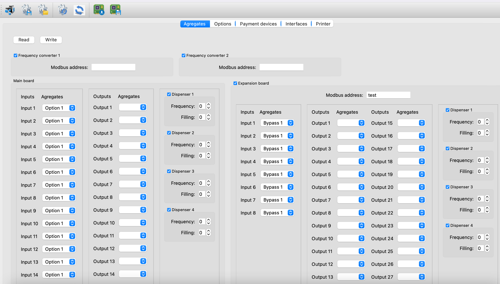
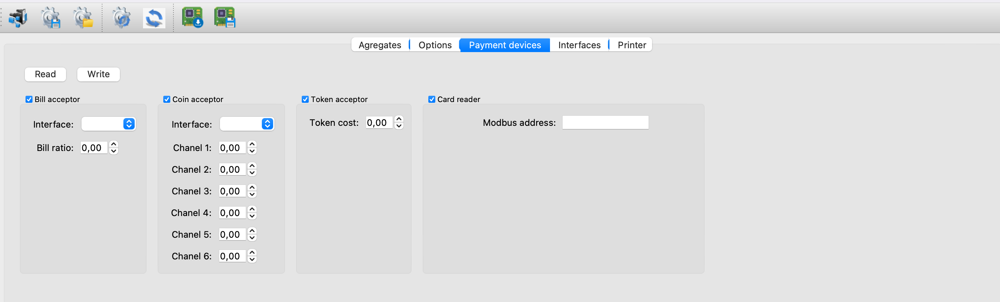
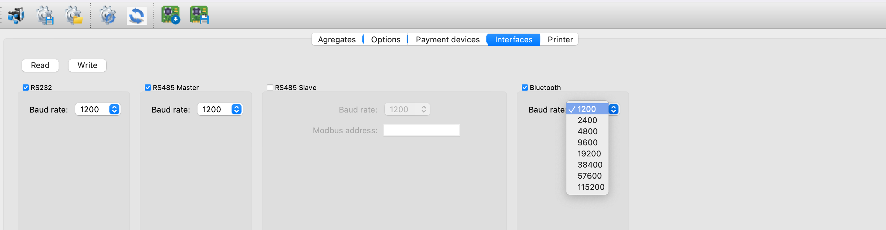

# DeWashPayPas (Raspberry Pi application)
The Raspberry Pi application is for integration between the self-service car wash controller and contactless payment device Ingenico.

The application communicates with the car wash controller through the Modbus protocol. Analyze commands and send them to the contactless payment device. Then receive responses from the payment device, generate a package and send it to the hardware device.

# DewashConfigurator (Qt application)
The GUI desktop application allows configuring a self-service car wash controller from a computer. In particular, settings that were set manually on a hardware device. For example, inputs/outputs, interface settings, car wash data, and payment device settings.
The application was created using the Qt framework. The application communicates with the hardware equipment through RS232 interface and uses Modbus protocol.

# CarWasherViewer (IOS application)
IOS application developed for DeWash company to display data from a Web server. 
The information is displayed to the user in tables and charts. There is a possibility to filter data by time, display, change and save data on the server for different modes.
